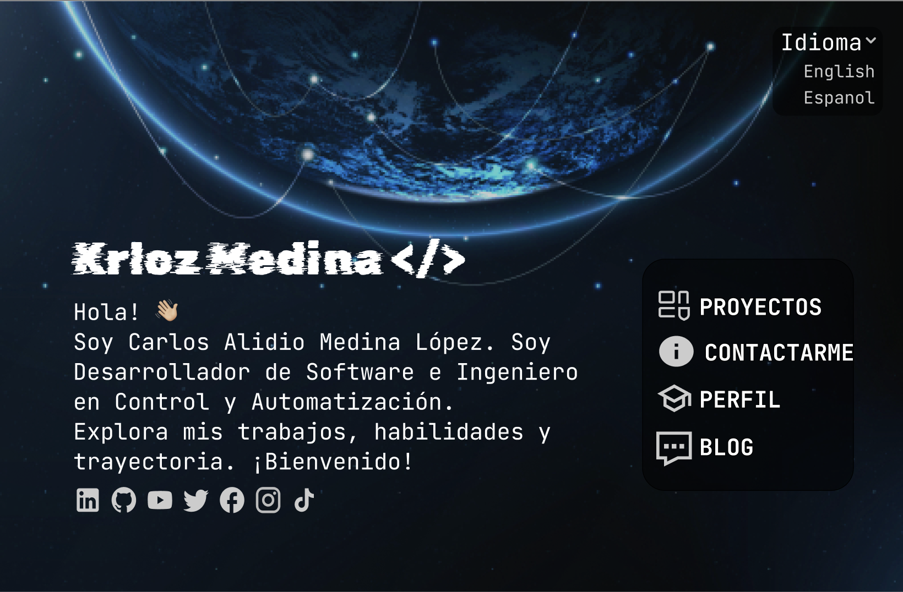
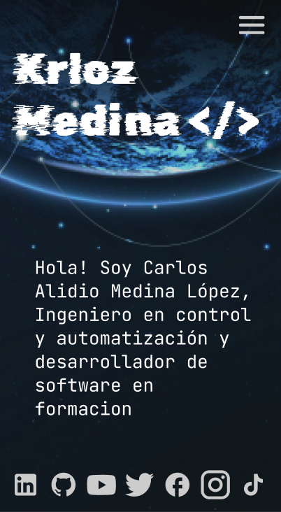

# Techfolio Krloz Medina

### 🧠 Código + Creatividad | Portafolio Web y Proyectos Maker

<!-- Badges -->
 
 
 
 


[](https://github.com/KrlozMedina)
[](https://krlozmedina.dev)
[](https://creativecommons.org/licenses/by-nc/4.0/)
<!--  -->


---

**Techfolio KrlozMedina** es un portafolio digital interactivo que reúne mis proyectos como desarrollador full stack, combinando creatividad, diseño y tecnología. Este espacio fue diseñado como una vitrina profesional para mostrar tanto soluciones técnicas como ideas innovadoras en desarrollo web y proyectos maker.

Desarrollado con **Next.js**, **CSS** y una **API personalizada**, este portafolio ofrece una experiencia visual moderna e intuitiva que permite a los visitantes explorar fácilmente mis habilidades, formación académica y experiencia laboral.

### 🎯 ¿Qué hace este proyecto?

- Presenta una colección organizada de mis proyectos destacados, con descripciones, enlaces y visuales interactivos.
- Muestra información actualizada sobre mis estudios, tecnologías que domino y experiencias laborales.
- Soporta múltiples idiomas (español e inglés) para ampliar su alcance.
- Está pensado para ser escalable, fácil de mantener y adaptable a nuevos contenidos.

🚀 Ideal para mejorar mi presencia online, conectar con oportunidades profesionales y compartir mi enfoque creativo como desarrollador.


## 📑 Tabla de Contenido
- [✨ Características Principales](#características-principales)
- [🖼️ Avatares del Sistema](#avatares-del-sistema)
- [🛠️ Tecnologías Utilizadas](#tecnologías-utilizadas)
- [🎨 Diseño y Experiencia de Usuario](#diseño-y-experiencia-de-usuario-ux)
- [🔍 SEO y Accesibilidad](#seo-y-accesibilidad)
- [📂 Estructura del Proyecto](#estructura-del-proyecto)
- [🚀 Demostración en Vivo](#demostración-en-vivo)
- [📦 Instalación y Uso](#instalación--uso)
- [✅ Calidad del Código y Pruebas](#calidad-del-código-y-pruebas)
- [🤝 Contribuciones](#contribuciones)
- [📝 Licencia](#licencia)
- [📬 Contacto](#contacto)

<!-- - [💡 Inspiración y Agradecimientos](#inspiración-y-agradecimientos) -->

## ✨ Características Principales

- **Portafolio interactivo y moderno**: Interfaz atractiva, profesional y funcional que presenta tus proyectos de manera visual e intuitiva.
- **Diseño responsive**: Totalmente adaptable a dispositivos móviles, tabletas y pantallas de escritorio.
- **Gestión dinámica de contenido**: Conectado a una API personalizada que permite actualizar el contenido sin necesidad de modificar el código fuente.
- **Soporte multilingüe**: Interfaz bilingüe en español e inglés, ideal para ampliar tu alcance global.
- **Navegación fluida**: Transiciones suaves entre secciones, con descripciones detalladas, enlaces a repositorios y demostraciones.
- **Tecnologías destacadas por proyecto**: Cada proyecto muestra las tecnologías utilizadas con íconos, nombres y enlaces relevantes.
- **Integración con redes sociales**: Enlaces a tus perfiles profesionales (LinkedIn, GitHub, Twitter, entre otros).
- **Avatar de usuario**: Componente visual personalizado que representa al usuario autenticado dentro de la interfaz.
- **Autenticación de usuarios y roles**: Implementación de inicio de sesión con control de acceso según el rol (ej. administrador).
- **Protección de rutas**: Acceso restringido a secciones privadas del sitio mediante autenticación.
- **Despliegue online**: Preparado para ser alojado en plataformas como Vercel, Netlify o GitHub Pages.
- **Escalable y mantenible**: Arquitectura modular que permite agregar fácilmente nuevos proyectos, secciones o funcionalidades.

## Avatares del Sistema

Se han integrado avatares ilustrativos para representar visualmente diferentes estados y respuestas del sistema. Estos avatares ayudan a mejorar la experiencia del usuario, brindando un toque amigable y expresivo a cada situación que pueda surgir durante el uso de la aplicación.

### 🎨 Detalles de los Avatares

| Situación                     | Código HTTP | Descripción Visual                                 | Estado     |
|------------------------------|-------------|----------------------------------------------------|------------|
| Error general del sistema    | —           | Chispas volando, expresión de susto                | ✅ Creado  |
| Error del servidor           | 500         | Electricidad, cejas fruncidas                      | ✅ Creado  |
| Página no encontrada         | 404         | Buscando con una lupa, cara de duda                | ✅ Creado  |
| Filtros sin resultados       | —           | Bandeja vacía, encogimiento de hombros             | ✅ Creado  |
| Guardado exitoso de datos    | 200         | Pulgar arriba, fondo luminoso                      | ✅ Creado  |
| Cargando datos               | —           | Engranajes girando detrás                          | ✅ Creado  |
| Acceso denegado              | 403         | Brazos cruzados, fondo oscuro                      | ✅ Creado  |
| Confirmación de eliminación  | —           | Botón rojo, mirada decidida                        | ✅ Creado  |
| Usuario no autenticado       | 401         | Tocando puerta cerrada, cara confundida            | ✅ Creado  |

### 🧩 Formato de las Imágenes

- Estilo: Ilustración digital semirrealista (antropomórfico)
- Dimensiones: Alta resolución
- Fondo: Transparente (`.png`)
- Uso: Integrados en pantallas de estado del frontend


## 🛠️ Tecnologías Utilizadas

El desarrollo de este portafolio combina herramientas modernas para ofrecer una experiencia fluida, personalizable y escalable:

### 🔧 Lenguajes y Frameworks
- **Next.js** – Framework de React para renderizado híbrido (SSR/SSG) y rutas dinámicas.
- **React** – Librería principal para construir interfaces interactivas y reutilizables.
- **JavaScript (ES6+)** – Lenguaje base para la lógica del cliente.
- **CSS Modules / SCSS** – Para estilos encapsulados, reutilizables y mantenibles.

### 📦 Gestión de Estado
- **Redux Toolkit** – Manejo global del estado con lógica centralizada y simplificada.
- **Redux Persist** – Persistencia del estado entre sesiones en el navegador.

### 🎨 Diseño y Experiencia de Usuario
- **Figma** – Bocetado y prototipado visual previo al desarrollo.
- **Diseño Responsive** – Adaptado a dispositivos móviles, tablets y escritorios.

### 📡 Backend y Datos
- **API personalizada (REST)** – Gestión dinámica del contenido del portafolio.
- **MongoDB + Mongoose** – Base de datos NoSQL para almacenar información estructurada mediante esquemas definidos.
- **JWT (JSON Web Tokens)** – Para autenticación segura y protección de rutas privadas.

### ☁️ Hosting y Despliegue
- **Vercel** – Hosting optimizado y despliegue continuo para proyectos con Next.js.
- **GitHub** – Control de versiones, colaboración abierta y automatización mediante Actions.

### 🧰 Herramientas de Desarrollo
- **pnpm** – Gestor de paquetes rápido y eficiente.
- **ESLint** – Análisis estático para mantener un código limpio y consistente.
- **Prettier** – Formateador de código para una estructura uniforme.
- **GitHub Actions** – Automatización de flujos de trabajo como despliegues o pruebas.

> Estas tecnologías permiten mantener el portafolio actualizado, modular, seguro y preparado para escalar o integrar nuevas funcionalidades con facilidad.


## Diseño y Experiencia de Usuario (UX)

Este proyecto ha sido concebido con un enfoque centrado en el usuario, priorizando la usabilidad, la accesibilidad y una estética coherente. A continuación, se detallan los principios de diseño aplicados y se presentan visualizaciones que ilustran la experiencia del usuario.

### Principios de diseño aplicados

- **Diseño centrado en el usuario (UCD)**: Cada decisión de diseño se basa en las necesidades y expectativas de los usuarios finales.
- **Consistencia visual y funcional**: Se mantiene una coherencia en los elementos visuales y en la interacción en todas las páginas para facilitar la navegación.
- **Accesibilidad**: Se siguen las pautas de accesibilidad para garantizar que el contenido sea utilizable por personas con diversas capacidades.
- **Feedback inmediato**: La interfaz proporciona respuestas claras a las acciones del usuario, como confirmaciones visuales y mensajes de error comprensibles.
- **Estética minimalista**: Se adopta un diseño limpio y enfocado en el contenido para evitar distracciones y mejorar la legibilidad.

### 📸 Visualizaciones de la interfaz

A continuación, se presentan algunas capturas de pantalla que muestran cómo luce la interfaz de usuario en diferentes dispositivos:

#### 🖥️ Vista de Escritorio



#### 📱 Vista Móvil



### 🧩 Prototipos interactivos

Para explorar los diseños completos y la navegación interactiva, puedes acceder al prototipo en Figma:

- [Enlace al diseño en Figma](https://www.figma.com/design/u8Z7UxAuamfPEz4rvxnIcA/Portafolio?node-id=0-1&p=f&t=t6qi44HZUejdKWSP-0)

Este prototipo permite experimentar la experiencia del usuario tal como fue concebida, facilitando una comprensión más profunda del flujo y la interacción dentro del proyecto.

## 🔍 SEO y Accesibilidad

Este proyecto ha sido desarrollado siguiendo las mejores prácticas de SEO y accesibilidad para garantizar una experiencia óptima para todos los usuarios y mejorar la visibilidad en motores de búsqueda.

### SEO
- Uso de etiquetas HTML semánticas para estructurar correctamente el contenido.
- Inclusión de metadatos relevantes en cada página.
- Optimización de imágenes con atributos `alt` descriptivos.
- URLs amigables y estructuradas.

### Accesibilidad
- Cumplimiento con las pautas WCAG 2.1 para asegurar la accesibilidad del contenido.
- Contraste adecuado entre texto y fondo para facilitar la lectura.
- Navegación mediante teclado habilitada en todas las secciones.
- Uso de roles ARIA donde es necesario para mejorar la comprensión por parte de tecnologías asistivas.


## Estructura del Proyecto
La estructura de este proyecto está organizada de forma modular para facilitar el mantenimiento, la escalabilidad y la separación de responsabilidades entre las diferentes partes del sistema. Este proyecto se basa en una arquitectura que sigue el principio de Atomic Design, utilizando componentes atómicos, moleculares, orgánicos y plantillas. A continuación se describe la organización de las carpetas y los archivos principales.

### Árbol de Carpetas
```plaintext
├── app
│   ├── api
│   │   ├── v1
│   │   │   ├── auth
│   │   │   ├── projects
│   │   │   └── technologies
│   │   └── v2
│   │       ├── auth
│   │       └── projects
│   ├── blog
│   ├── clients
│   ├── contact
│   ├── dashboard
│   │   ├── projects
│   │   │   └── sections
│   ├── gallery
│   ├── login
│   ├── profile
│   │   ├── about-me
│   │   ├── achievements
│   │   ├── certifications
│   │   ├── education
│   │   ├── experience
│   │   ├── skills
│   ├── projects
│   │   ├── case-studies
│   │   ├── services
│   │   └── testimonials
│   ├── resources
│   ├── resume
│   └── unauthorized
├── components
│   ├── atom
│   │   ├── buttons
│   │   ├── feedback
│   │   ├── form
│   │   └── media
│   ├── molecules
│   │   ├── Cards
│   │   ├── FeedbackStates
│   │   ├── Footer
│   │   ├── LanguageToggle
│   │   ├── Navbar
│   │   ├── QuoteBlock
│   │   ├── SocialLinks
│   │   └── ThemeToggle
│   ├── organisms
│   │   ├── Headers
│   │   ├── Modal
│   │   ├── Notice
│   │   ├── SettingPanel
│   │   └── Slider
│   └── templates
│       ├── AuthLayout
│       ├── ErrorTemplate
│       └── MainLayout
├── context
├── hooks
├── lib
│   ├── config
│   ├── db
│   ├── dtos
│   ├── helpers
│   ├── middleware
│   ├── utils
│   └── validators
├── mocks
├── models
│   └── project
├── providers
├── shared
│   ├── config
│   ├── constants
│   ├── types
│   └── utils
├── store
│   ├── service
│   ├── slices
└── styles
    ├── base
    ├── pages
    └── variables
```

### Explicación de las Carpetas

1. `app/`  
Esta carpeta contiene todas las páginas y recursos principales de la aplicación. Está organizada en módulos que agrupan rutas relacionadas con diferentes secciones de la aplicación:
- `api/`: Endpoints de la API, organizados por versión (`v1`, `v2`) y sus respectivos recursos como `auth`, `projects` y `technologies`.
- `blog/`: Página de blog con entradas relacionadas.
- `clients/`: Información sobre clientes.
- `contact/`: Página de contacto.
- `dashboard/`: Panel de administración que contiene secciones como proyectos y sus subsecciones.
- `login/`: Página de inicio de sesión.
- `profile/`: Información detallada del perfil, incluyendo secciones como `about-me`, `achievements`, `certifications`, `education`, `experience` y `skills`.
- `projects/`: Sección de proyectos, con subsecciones para `case-studies`, `services` y `testimonials`.
- `resources/`: Página de recursos adicionales.
- `resume/`: Página con el currículum del desarrollador.
- `unauthorized/`: Página que muestra acceso denegado o autorización insuficiente.

2. `components/`  
Contiene los componentes reutilizables divididos por niveles de complejidad siguiendo Atomic Design:  
- `atom/`: Componentes más simples y fundamentales como botones, formularios, feedback y medios.  
- `molecules/`: Componentes compuestos por varios átomos, como tarjetas, estados de feedback, pie de página, barra de navegación, entre otros.  
- `organisms/`: Componentes más complejos como encabezados, modales, paneles de configuración y sliders.  
- `templates/`: Plantillas de disposición general como `AuthLayout`, `ErrorTemplate` y `MainLayout`.

3. `context/`  
Define contextos de React para compartir estado o lógica entre componentes sin necesidad de prop drilling.

4. `hooks/`  
Hooks personalizados para reutilizar lógica React en distintos componentes.

5. `lib/`  
Contiene utilidades y funciones compartidas, configuraciones, validadores, middleware, helpers y conexión a la base de datos.

6. `mocks/`  
Datos ficticios para pruebas y desarrollo.

7. `models/`  
Modelos que definen la estructura de las entidades de datos, como proyectos.

8. `providers/`  
Componentes que proveen contextos o servicios globales a la aplicación.

9. `shared/`  
Contiene configuraciones, constantes, tipos y utilidades compartidas en toda la aplicación.

10. `store/`  
Configuración de Redux para manejar el estado global, incluyendo slices y servicios.

11. `styles/`  
Estilos globales y específicos organizados en:  
- `base/` para estilos base,  
- `pages/` para estilos específicos de páginas,  
- `variables/` para variables CSS y temas.

---

### 🌐 Rutas del Portafolio

#### Páginas Públicas
- `/`: Página de inicio con presentación general y enlaces a las secciones principales.
- `/projects`: Lista de proyectos destacados.
  - `/projects/services`: Servicios ofrecidos.
  - `/projects/testimonials`: Testimonios de clientes o colaboradores.
  - `/projects/case-studies`: Estudios de caso detallados.
- `/profile`: Perfil profesional con información personal, logros y experiencia.
  - `/profile/about-me`
  - `/profile/education`
  - `/profile/skills`
  - `/profile/certifications`
  - `/profile/experience`
  - `/profile/achievements`
- `/blog`: Blog con artículos y publicaciones.
- `/contact`: Formulario de contacto.
- `/clients`: Lista de clientes con testimonios y casos de éxito.
- `/gallery`: Galería de imágenes o proyectos visuales.
- `/resume`: Currículum vitae con opción de descarga.

#### Rutas Privadas
- `/dashboard`: Panel de administración interno (solo para el autor), para gestionar proyectos y tecnologías.
- `/login`: Página de inicio de sesión.

#### Rutas de API
- `/api/v1/auth/login`: Inicio de sesión y validación de credenciales.
- `/api/v1/auth/logout`: Cierre de sesión.
- `/api/v1/projects`: Gestión de proyectos (CRUD).
- `/api/v1/technologies`: Gestión de tecnologías (CRUD).

## Demostración en Vivo

Te invito a explorar mi portafolio digital en [krlozmedina.dev](https://krlozmedina.dev), una experiencia completamente interactiva desarrollada con tecnologías modernas y desplegada gracias a los servicios de [Vercel](https://vercel.com/).

Este sitio fue diseñado no solo como una vitrina de proyectos, sino como una experiencia para conocer quién soy como desarrollador, cómo trabajo y qué me inspira.

### 🔍 ¿Qué encontrarás?

1. **🎯 Proyectos** – Una galería interactiva donde presento soluciones reales, ideas creativas y herramientas utilizadas.
2. **👨‍💻 Perfil** – Un recorrido por mis habilidades técnicas, trayectoria y filosofía de trabajo.
3. **📝 Blog** – Espacio para compartir aprendizajes, reflexiones y contenidos técnicos (en evolución).
4. **📬 Contacto** – Un formulario funcional para conectar directamente conmigo.

🌐 Accede ahora: [https://krlozmedina.dev](https://krlozmedina.dev)

## Instalación / Uso

Sigue estos pasos para clonar y ejecutar el proyecto localmente en tu máquina:

### 1. Clona el repositorio
```bash
git clone https://github.com/KrlozMedina/Techfolio.git
```

### 2. Entra al directorio del proyecto
```bash
cd techfolio
```

### 3. Instala las dependencias
Asegúrate de tener instalado [Node.js](https://nodejs.org/es) y [pnpm](https://pnpm.io/)
```bash
pnpm install
```

### 4. Configura las variables de entorno
Crea un archivo .env en la raíz del proyecto y añade tus variables. Un ejemplo básico:
```env
DATABASE_URL=mongodb+srv://<usuario>:<contraseña>@<cluster>.mongodb.net/<base_de_datos>?retryWrites=true&w=majority
JWT_USERNAME=tu_usuario_jwt
JWT_PASSWORD=tu_contraseña_jwt
JWT_SECRET=tu_clave_secreta_jwt
```

### 5. Ejecuta el proyecto en modo desarrollo
```bash
pnpm dev
```

La aplicación se ejecutará en `http://localhost:3000`.
¡Abre tu navegador y explora tu portafolio localmente!

📦 Para construir la versión lista para producción:
```bash
pnpm build
pnpm start
```

### 🚀 Despliegue en Vercel

Puedes desplegar tu portafolio fácilmente en [Vercel](https://vercel.com), plataforma optimizada para proyectos con Next.js. Sigue estos pasos:

1. **Importa el repositorio en Vercel**
   - Ve a [vercel.com/import/git](https://vercel.com/import/git)
   - Conéctate con tu cuenta de GitHub y selecciona el repositorio del portafolio (`techfolio`)

2. **Establece las variables de entorno**
   - En el panel de configuración del proyecto, añade las variables necesarias:
        ```env
        DATABASE_URL=mongodb+srv://<usuario>:<contraseña>@<cluster>.mongodb.net/<base_de_datos>?retryWrites=true&w=majority
        JWT_USERNAME=tu_usuario_jwt
        JWT_PASSWORD=tu_contraseña_jwt
        JWT_SECRET=tu_clave_secreta_jwt
        ```

3. **Despliegue automático**
   - Vercel detectará automáticamente que es un proyecto Next.js y lo desplegará tras cada commit a la rama `main`.

4. **Accede a tu portafolio**
   - Una vez completado el despliegue, obtendrás una URL del tipo:
     ```
     https://techfolio.vercel.app
     ```

✅ ¡Listo! Tu portafolio estará disponible online y actualizado con cada cambio que hagas.

## Calidad del Código y Pruebas

Este portafolio implementa buenas prácticas de desarrollo para asegurar calidad y mantenibilidad:

### 🧪 Pruebas

- **Framework de pruebas**: Se utiliza [Jest](https://jestjs.io/) para realizar pruebas unitarias y de integración.
- **Cobertura**: El objetivo es mantener una cobertura de código superior al 90%.
- **Ejecución de pruebas**:&#8203;:contentReference[oaicite:3]{index=3}

  ```bash
  # Instalar dependencias
  npm install

  # Ejecutar pruebas
  npm test
    ```

- **Cobertura de pruebas**: Para generar un informe de cobertura, ejecuta:

    ```bash
    npm run test:coverage
    ```

El informe se generará en la carpeta `coverage/`.​

### 🧹 Buenas Prácticas
- **Estilo de código**: Se sigue la guía de estilo de [Airbnb](https://github.com/airbnb/javascript) para JavaScript.
- **Linting**: Se utiliza [ESLint](https://eslint.org/) para mantener un código limpio y consistente.
- **Formateo**: [Prettier](https://prettier.io/) se emplea para el formateo automático del código.
- **Hooks de pre-commit**: Se implementan hooks con [Husky](https://typicode.github.io/husky/) para ejecutar linters y pruebas antes de cada commit.​

### 🔒 Seguridad
- **Análisis de vulnerabilidades**: Se utiliza [npm audit](https://docs.npmjs.com/cli/v7/commands/npm-audit/) para detectar y corregir vulnerabilidades en las dependencias.​
    ```bash
    npm audit
    ```
- **Actualización de dependencias**: Se recomienda revisar y actualizar las dependencias regularmente para mantener la seguridad del proyecto.​

Estas prácticas aseguran que el proyecto sea robusto, seguro y fácil de mantener.

## Contribuciones

¡Gracias por tu interés en contribuir! Si deseas colaborar con este proyecto, por favor revisa el archivo [CONTRIBUTING.md](./CONTRIBUTING.md) para obtener detalles sobre cómo hacerlo de forma efectiva y ordenada.

También puedes ayudar reportando errores o sugiriendo mejoras desde la sección de [issues](https://github.com/KrlozMedina/Techfolio/issues).

### 📄 Código de conducta
Este proyecto sigue un [Código de Conducta](https://github.com/KrlozMedina/Techfolio/blob/main/CODE_OF_CONDUCT.md) para asegurar un ambiente abierto y acogedor para todos los colaboradores.

<!-- ## 💡 Inspiración y Agradecimientos

Este proyecto se inspiró en la necesidad de crear soluciones accesibles y optimizadas para la web moderna. Agradezco profundamente a todas las personas y comunidades que compartieron su conocimiento y experiencias, lo cual fue fundamental para el desarrollo de este trabajo.

Agradecimientos especiales a:
- [Nombre de la persona o entidad] por su apoyo y orientación.
- [Nombre de la comunidad o recurso] por proporcionar recursos valiosos y documentación detallada.
- [Nombre del mentor o colega] por sus valiosos comentarios y sugerencias durante el proceso de desarrollo. -->

## Licencia

Este proyecto está licenciado bajo los términos de la [Licencia Creative Commons Atribución-NoComercial 4.0 Internacional (CC BY-NC 4.0)](https://creativecommons.org/licenses/by-nc/4.0/deed.es). Puedes consultar los detalles completos en el archivo [LICENSE.md](./LICENSE.md).

## Contacto

¿Tienes alguna pregunta, idea o simplemente quieres saludar? ¡Será un placer escucharte!

- ✉️ Correo: [kamedinal16@outlook.com](mailto:kamedinal16@outlook.com)
- 💼 LinkedIn: [linkedin.com/in/krlozmedina](https://linkedin.com/in/krlozmedina)
- 🌐 Portafolio: [krlozmedina.dev](https://krlozmedina.dev)
- 🐙 GitHub: [github.com/KrlozMedina](https://github.com/KrlozMedina)
- 📱 WhatsApp: [3504312615](https://wa.me/3504312615)
- 📅 Agenda una reunión: [calendly.com/krlozmedina](https://calendly.com/krlozmedina)
<!-- - 🐦 Twitter: [twitter.com/KrlozMedina](https://twitter.com/KrlozMedina) -->
